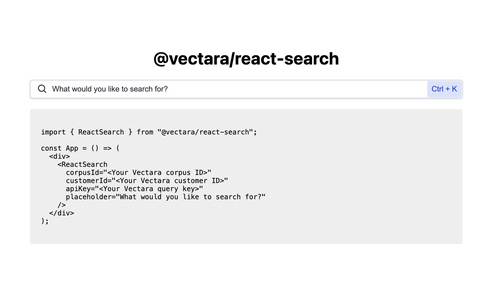

<p align="center">
  
</p>

## Development

This codebase comes with a development environment to facilitate enhancements and bug fixes. It allows developers to quickly iterate on the code and verify changes instantly.

### Running the development environment

From the root directory, run:

```
npm run dev
```

This spins up an application running at `http://localhost:8080/`. Your latest changes will be reflected here.



### Making changes to the component

Once the development environment is running, any changes made to .ts and .tsx files in the `/src` directory will trigger a rebuild of the component and a reload of the webpage.

Additionally, any changes to the development app source code at `/dev/index.tsx` will also trigger a rebuild + reload.
